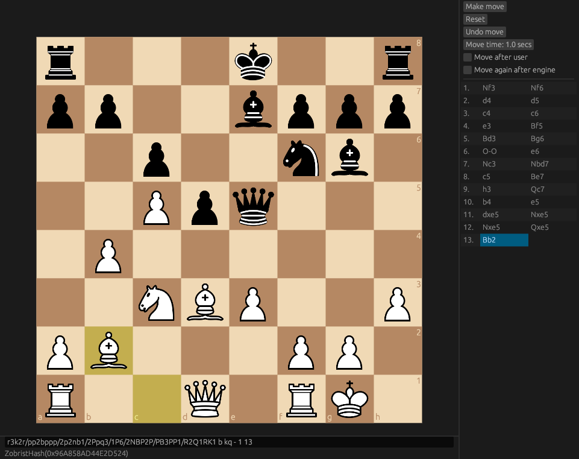

# Harðfiskur

Harðfiskur is a work-in-progress hobby chess engine, plus a basic UI written
with egui. It also provides an executable implementing the Universal Chess
Interface (UCI) (`hardfiskur_uci`).

Harðfiskur is a type of Icelandic dried fish, traditionally dried by air. It
resembles fish jerky and is often eaten with butter.



A very rough estimation of Harðfiskur's playing strength is ~2900 ELO, obtained
by testing against [Stash](https://gitlab.com/mhouppin/stash-bot) v25, which is
ranked on CCRL at 2933 ELO.

## Compiling

Harðfiskur is provided in 2 forms -- the more useful of which is as
a UCI-compatible binary. This can be built with the provided Makefile.

Simply ensure you have an up-to-date Rust toolchain installed, and then run in
the root of the repository:

```bash
make
```

This will produce an executable called `hardfiskur` which should be compatible
with any UCI-based chess UI program, e.g. CuteChess.

Harðfiskur also has an egui-based UI. This can be built and run with:

```bash
cargo run --release
```

## Engine features

Harðfiskur is a traditional minimax-based engine with an HCE (hand-crafted
evaluation) function.

### Board representation

* Bitboard
* Magic bitboards for move generation
* Zobrist hashing for transposition table lookup

### Search features

* Negamax search
* Alpha-beta pruning
* Iterative deepening
* Quiescence search
* Transposition table for alpha-beta cutoffs
* Principal variation search
* Adaptive aspiration windows
* Forward pruning techniques
    * Reverse futility pruning
    * Null move pruning
* Internal iterative reductions
* Late move reductions
* Move ordering
    * SEE (Static Exchange Evaluation)
    * MVV-LVA (Most Valuable Victim - Least Valuable Attacker)
    * Killer-move heuristic
    * Butterfly history heuristic (for remaining quiet moves)

### Evaluation features

* Texel's tuning method (evaluation is a linear function of features of the
  board state, which is then tuned using gradient descent)
* Material evaluation
* Piece-square tables
* Mobility evaluation
* Open and semi-open file evaluation
* Outpost evaluation
* King zone attacks
* Virtual mobility evaluation
* Pawn structure evaluation
    * Passed pawns
    * Doubled pawns
    * Isolated pawns
    * Pawn shields
    * Protected pawns
    * Phalanx pawns

### Time management features

* Hard and soft bounds
* Effort-based soft bound adjustment

## Inspirations

This project draws inspiration from a number of sources and is built using
a number of open source tools, an incomplete list of which is below:

* [The Chess Programming Wiki](https://www.chessprogramming.org/)
* The #engine-dev channel in the Stockfish discord
* The [fastchess](https://github.com/Disservin/fastchess) tool by Disservin
* The [OpenBench](https://github.com/andygrant/openbench) tool by AndyGrant
* GediminasMasaitis's [Texel tuner](https://github.com/GediminasMasaitis/texel-tuner/)
* [Reckless](https://github.com/codedeliveryservice/Reckless) engine by codedeliveryservice
* [Stash](https://gitlab.com/mhouppin/stash-bot) engine by mhouppin
* [Weiss](https://github.com/TerjeKir/weiss) engine by TerjeKir
* [Ethereal](https://github.com/AndyGrant/Ethereal) engine by AndyGrant
* [Viridithas](https://github.com/cosmobobak/viridithas) engine by cosmobobak
